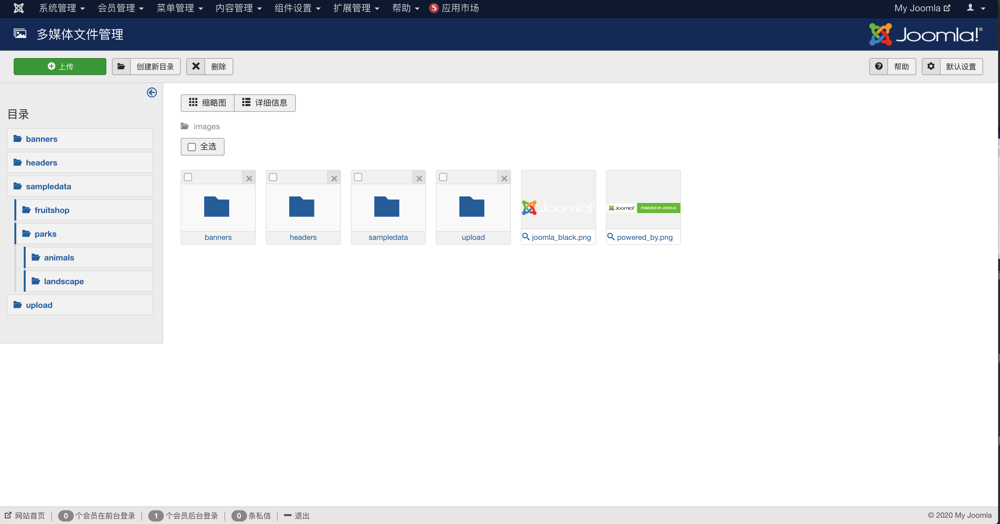

# 腾讯云图片内容安全插件

## 0.版本依赖

- 依赖 PHP 5.5+ 环境

- GuzzleHttp 6.3.0+ (如果有其它插件引用了 GuzzleHttp 库并低于 6.3.0 版本会引起插件冲突)

## 1.插件介绍
> tencentcloud_ims插件是一款腾讯云研发的。对用户上传的图片附件进行安全审核，识别过滤涉及黄、爆、恐的信息。

| 标题       | 内容                                                         |
| ---------- | ------------------------------------------------------------ |
| 中文名称     | 腾讯云图片内容安全（IMS）插件                                   |
| 英文名称   | tencentcloud_ims                                              |
| 最新版本   | v1.0.0 (2020.11.6)                                           |
| 适用平台   | [Joomla](https://joomla.org/)                                    |
| 适用产品   | [腾讯云图片内容安全（IMS）](https://cloud.tencent.com/product/ims)      |
| GitHub项目| [tencentcloud-joomla-plugin-ims](https://github.com/Tencent-Cloud-Plugins/tencentcloud-joomla-plugin-ims) |
| 主创团队   | 腾讯云中小企业产品中心（SMB Product Center of Tencent Cloud）             |

## 2.功能特性

- 对用户在多媒体媒体管理中上传的图片附件进行安全审核，识别过滤涉及黄、爆、恐的信息。

## 3.安装指引

### 3.1.部署方式一：通过GitHub部署安装

> 1. 执行git clone git@github.com:Tencent-Cloud-Plugins/tencentcloud-joomla-plugin-tms.git 将项目克隆下来
> 2. 用压缩工具对 tencentcloud_ims文件夹压缩成zip文件（如tencentcloud_ims.zip）
> 3. 进入自己搭建的joomla网站后台，切换到“扩展管理”中的“扩展安装”，将上一步生成的zip文件上传（拖放）到安装文件上传入口。
> 4. 在网站后台“扩展管理”的“插件管理”中可以找到安装好的"内容 - 腾讯云图片内容安全"插件，可开启、关闭和点击进入配置页面进行编辑。

### 3.2.部署方式二：在Joomla官网中下载腾讯云对象存储插件安装包进行安装
> 待补充

## 4.使用指引

### 4.1.界面功能介绍

> 在【扩展管理】->【插件安装】 -> 【扩展安装】中，上传腾讯云插件安装包。

  

> 在【扩展管理】->【插件管理】中，选中腾讯云对象存储插件，配置成"启用"状态。 

  

> 在【扩展管理】->【插件管理】中，选择腾讯云图片内容安插件，配置插件需要的相关信息。 

  

> 在【内容管理】->【多媒体文件管理】中上传图片。

  

> 在【内容管理】->【多媒体文件管理】中上传图片,图片内容涉及违规内容。

### 4.2.名词解释
- **SecretId**：在[腾讯云API密钥管理](https://console.cloud.tencent.com/cam/capi)上申请的标识身份的 SecretId。
- **SecretKey**：在[腾讯云API密钥管理](https://console.cloud.tencent.com/cam/capi)上申请的与SecretId对应的SecretKey。

## 5.FAQ

> 暂无

## 6.GitHub版本迭代记录

### 6.1 tencentcloud-joomla-plugin-ims v1.0.0
- 对用户在多媒体媒体管理中上传的图片附件进行安全审核，识别过滤涉及黄、爆、恐的信息。
---

本项目由腾讯云中小企业产品中心建设和维护，了解与该插件使用相关的更多信息，请访问[春雨文档中心](https://openapp.qq.com/docs/DiscuzX/tms.html) 

请通过[咨询建议](https://da.do/y0rp) 向我们提交宝贵意见。